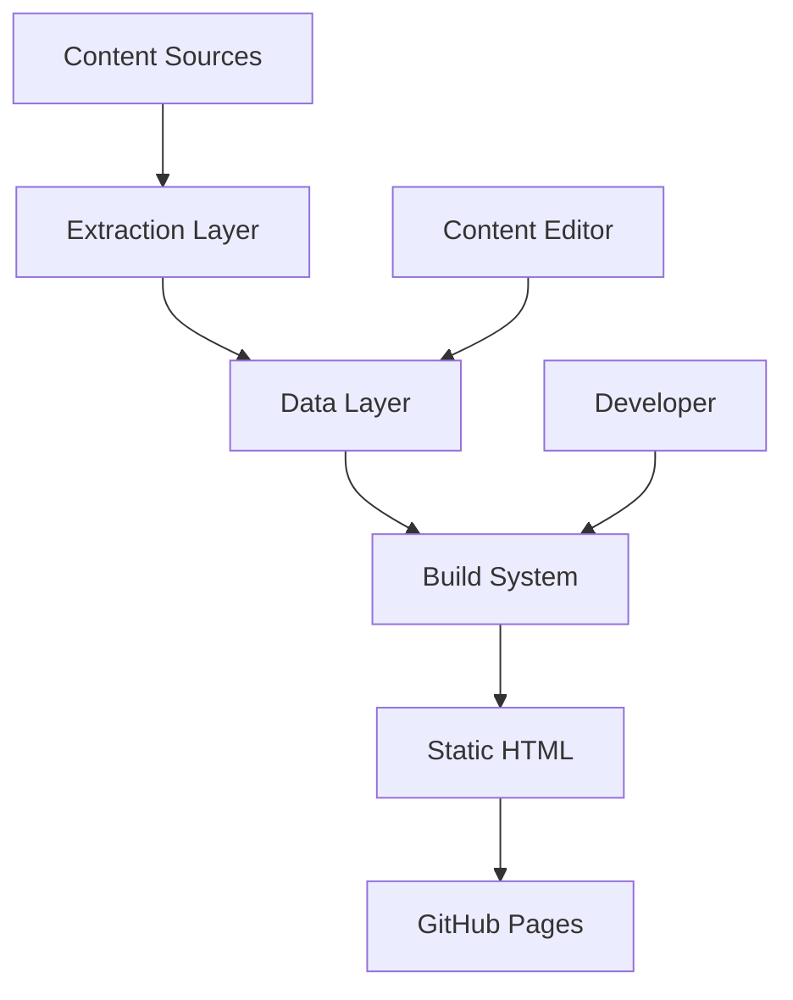

# FactBench Architecture Documentation

## 📐 System Architecture Overview

FactBench is a static site generator designed for creating high-performance product review pages. The architecture prioritizes speed, maintainability, and ease of content updates.



## 🏗️ Core Components

### 1. Content Extraction Layer

**Purpose**: Extract product data from external sources (e.g., zoopy.com)

**Components**:
- `scripts/extract-full-zoopy-data.py` - Main extraction script
- `scripts/download-images.js` - Image downloader

**Flow**:
```python
# 1. Fetch HTML from source
# 2. Parse with BeautifulSoup
# 3. Extract structured data
# 4. Generate JSON output
# 5. Download associated images
```

### 2. Data Layer

**Purpose**: Store and manage product information

**Structure**:
```json
{
  "products": [
    {
      "id": "unique-identifier",
      "name": "Product Name",
      "badge": "Award Type",
      "rating": 5.0,
      "userRatings": "17,000+",
      "features": {},
      "specifications": {},
      "affiliateLink": "https://..."
    }
  ]
}
```

**Files**:
- `/src/data/products.json` - Main product database
- `/src/data/config.json` - Site configuration (if needed)

### 3. Build System

**Purpose**: Transform source files into optimized static site

**Components**:
```
Build Pipeline:
1. Clean dist directory
2. Compile TailwindCSS
3. Process HTML templates
4. Optimize images
5. Copy static assets
6. Generate sitemap/robots.txt
```

**Key Files**:
- `scripts/build.js` - Main build orchestrator
- `scripts/generate-complete-page.js` - HTML generation
- `tailwind.config.js` - Style configuration

### 4. Template System

**Purpose**: Define reusable page structures

**Architecture**:
```
/src/pages/
├── best-robotic-pool-cleaners.html    # Page template
├── _partials/
│   ├── header.html                    # Reusable header
│   ├── footer.html                    # Reusable footer
│   └── product-card.html              # Product component
```

**Template Processing**:
1. Load base template
2. Inject product data
3. Process includes/partials
4. Minify output

### 5. Frontend Architecture

**Technology Stack**:
- **CSS Framework**: TailwindCSS 3.x
- **JavaScript**: Alpine.js 3.x (reactive components)
- **Charts**: Chart.js 4.x (data visualization)

**Component Structure**:
```javascript
// Alpine.js component example
Alpine.data('productCard', () => ({
    expanded: false,
    toggle() {
        this.expanded = !this.expanded
    }
}))
```

## 🔄 Data Flow

### Content Update Flow
```
1. Content Editor updates zoopy.com
2. Developer runs extraction script
3. Script generates new products.json
4. Build system processes changes
5. Deploy to GitHub Pages
```

### Build Process Flow
```
npm run build
    │
    ├─→ Clean dist/
    ├─→ Build CSS (TailwindCSS)
    ├─→ Process images
    ├─→ Generate HTML pages
    ├─→ Copy static assets
    └─→ Output to dist/
```

## 📁 Directory Structure

```
FactBench/
├── src/                    # Source files
│   ├── assets/            
│   │   ├── css/           # TailwindCSS input
│   │   ├── images/        # Source images
│   │   └── js/            # JavaScript files
│   ├── data/              # JSON data files
│   └── pages/             # HTML templates
├── dist/                  # Build output (Git ignored)
├── scripts/               # Build and utility scripts
├── docs/                  # Documentation
└── config/                # Configuration files
```

## 🎨 Design System Architecture

### Color System
```css
/* Primary Actions */
--cta-primary: #ef4444;     /* Red */
--cta-hover: #dc2626;       /* Dark red */

/* Badges */
--badge-gold: #fbbf24;      /* Best of the Best */
--badge-silver: #9ca3af;    /* Editor's Choice */
--badge-bronze: #f59e0b;    /* Great Value */

/* Base Colors */
--bg-primary: #0f172a;      /* Dark background */
--text-primary: #f8fafc;    /* Light text */
```

### Component Hierarchy
```
Page
├── Header
│   ├── Logo
│   └── Navigation
├── Hero Section
├── Product Grid
│   └── Product Cards
│       ├── Badge
│       ├── Image
│       ├── Rating
│       ├── Details (expandable)
│       └── CTA Button
├── Comparison Chart
└── Footer
```

## 🚀 Performance Architecture

### Optimization Strategies

1. **Static Generation**
   - Pre-built HTML pages
   - No server-side rendering
   - Instant page loads

2. **Asset Optimization**
   - WebP images with JPG fallbacks
   - Minified CSS/JS
   - Compressed HTML
   - Lazy loading for images

3. **Caching Strategy**
   - Long cache headers for assets
   - Filename hashing for cache busting
   - CDN-friendly structure

### Performance Metrics
```
Target Metrics:
- First Contentful Paint: < 1.5s
- Time to Interactive: < 3.5s
- Lighthouse Score: 95+
- Bundle Size: < 200KB (excluding images)
```

## 🔒 Security Architecture

### Security Measures
1. **Static Site Benefits**
   - No database to hack
   - No server-side vulnerabilities
   - No user input processing

2. **Content Security**
   - Sanitized extraction scripts
   - No executable code in content
   - HTTPS only deployment

3. **Dependency Management**
   - Regular updates
   - Security audits with npm audit
   - Minimal dependencies

## 🔄 Deployment Architecture

### GitHub Pages Deployment
```
Local Development
    │
    ├─→ Build Process
    ├─→ Git Commit
    ├─→ Push to GitHub
    └─→ GitHub Pages serves dist/
```

### Automated Deployment
```bash
# github-deploy.sh process
1. Build site locally
2. Clone GitHub repository
3. Clean old files
4. Copy new dist files
5. Commit changes
6. Push to main branch
7. GitHub Pages auto-deploys
```

## 🔌 Extension Points

### Adding New Product Categories
1. Create new page template in `/src/pages/`
2. Add extraction script for data source
3. Update build script to include new page
4. Deploy

### Adding New Features
1. **Filtering System**
   - Add filter UI components
   - Implement JavaScript filtering
   - Maintain URL state

2. **Search Functionality**
   - Client-side search with Fuse.js
   - Search index generation during build
   - Real-time results

3. **User Reviews**
   - Third-party review widget
   - Static review data in JSON
   - Review aggregation display

## 📊 Monitoring & Analytics

### Current State
- No analytics implemented (privacy-first)

### Future Considerations
```javascript
// Potential privacy-friendly analytics
// - Plausible Analytics
// - Simple Analytics
// - Self-hosted Matomo
```

## 🏛️ Architectural Decisions

### ADR-001: Static Site Generation
**Decision**: Use static site generation instead of dynamic server
**Rationale**: 
- Superior performance
- Lower hosting costs
- Better security
- Easier maintenance

### ADR-002: TailwindCSS for Styling
**Decision**: Use TailwindCSS utility classes
**Rationale**:
- Consistent design system
- Small bundle size with PurgeCSS
- Rapid development
- Easy maintenance

### ADR-003: Alpine.js for Interactivity
**Decision**: Use Alpine.js instead of React/Vue
**Rationale**:
- Minimal bundle size (15KB)
- No build step required
- Progressive enhancement
- Simple learning curve

## 🔮 Future Architecture Plans

### Phase 2 Enhancements
- API endpoint for product data
- Automated content updates
- A/B testing framework
- Enhanced analytics

### Phase 3 Scaling
- Multi-language support
- Regional content variants
- CDN optimization
- Advanced caching strategies

---

*This architecture is designed to scale while maintaining simplicity and performance.*